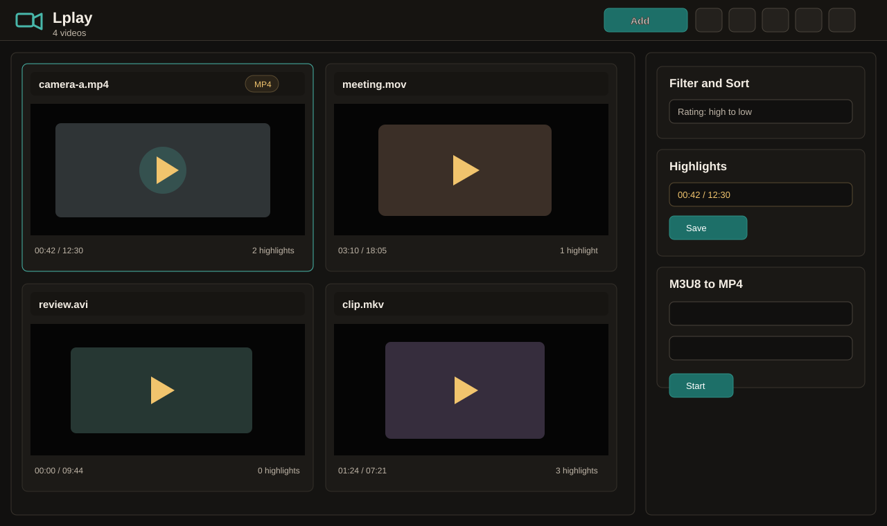
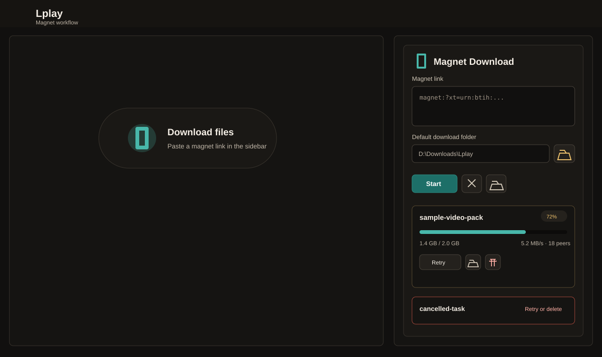
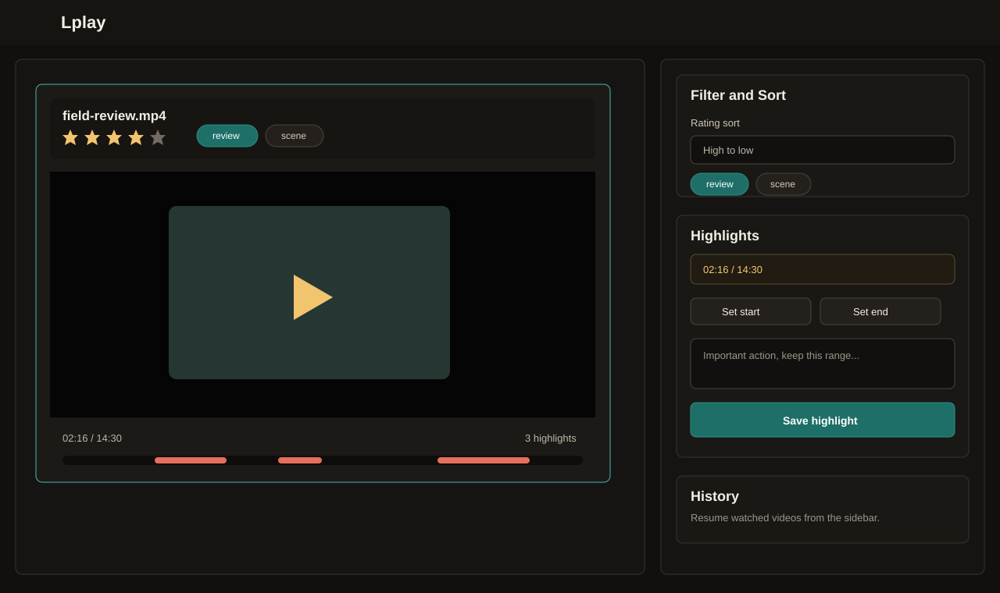

# Lplay

[简体中文](../README.md) | **English**

Lplay is a Windows desktop multi-video player built with Electron, React, TypeScript, Vite, FFmpeg, and WebTorrent. It is designed for viewing multiple local videos at the same time, marking highlight ranges, managing ratings and tags, converting M3U8 playlists to MP4, and downloading files from magnet links.

## Screenshots

### Multi-Video Playback



### Magnet Downloads



### Highlights, Ratings, and Tags



## Features

- Play multiple local videos at the same time with automatic split-screen layout.
- Drag and drop video files into the player.
- Supports common formats such as MP4, MOV, WebM, AVI, MKV, WMV, and FLV.
- Automatically transcodes videos that Chromium cannot decode into H.264/AAC MP4 cache files.
- Add highlight/bookmark time ranges with notes for each video.
- Save playback history, including file path, last position, duration, and last played time.
- Add ratings and tags to videos, then sort by rating or filter by tag from the right sidebar.
- Download local or remote `.m3u8` playlists and remux them to `.mp4`.
- Download files directly from magnet links with a configurable default download folder.
- Magnet download records can be retried or deleted manually; cancelled tasks stay visible until you remove them.
- Windows packaged builds include FFmpeg/FFprobe.

## Quick Start

Run the portable executable:

```text
release/Lplay-0.2.0-portable.exe
```

If Windows SmartScreen shows a warning, choose "More info" and then "Run anyway". This happens because the app is not code-signed.

## Usage

### Import and Play Videos

1. Click "Add Video" in the toolbar, or drag video files into the window.
2. When multiple videos are selected, Lplay lays them out automatically.
3. If a codec cannot be played directly, Lplay transcodes the file into a compatible MP4 cache with FFmpeg.

### Highlights

1. Select a video.
2. Use the right sidebar to set the highlight start and end points.
3. Add a note and save. The highlight appears on the timeline rail below the video.

### Ratings and Tags

1. Click the stars in a video card to set a rating.
2. Enter tags such as `review, scene`.
3. Use the "Filter and Sort" panel to sort by rating or filter by tag.

### M3U8 to MP4

1. Enter a remote M3U8 URL or choose a local `.m3u8` file.
2. Choose the output `.mp4` path.
3. Click "Convert". The result can be added to the player after conversion.

### Magnet Downloads

1. Paste a `magnet:?xt=urn:btih:...` link into the "Magnet Download" panel.
2. Use the folder button to configure the default download folder.
3. Click "Download" to start the task.
4. Cancelled, failed, and completed tasks stay in the list so you can retry or delete them manually.

If no folder is configured, files are saved under the system Downloads folder in a `Lplay` subfolder.

## Development

Recommended environment:

- Windows 10/11
- Node.js 20+
- npm
- FFmpeg/FFprobe optional during development

Install dependencies:

```bash
npm install
```

Start the development app:

```bash
npm run dev
```

The development launcher starts Vite from `http://127.0.0.1:5173`. If the port is already in use, it automatically tries the next available port and passes the correct URL to Electron.

Specify a custom starting port:

```powershell
$env:LPLAY_PORT=5180
npm run dev
```

## Build and Package

Build the renderer:

```bash
npm run build
```

Build a Windows portable executable:

```bash
npm run dist
```

Build a Windows installer:

```bash
npm run dist:installer
```

Output directory:

```text
release/
```

Current portable executable:

```text
release/Lplay-0.2.0-portable.exe
```

## FFmpeg Bundling

Packaged builds look for FFmpeg binaries at:

```text
resources/bin/ffmpeg.exe
resources/bin/ffprobe.exe
```

In the repository, place them here before packaging:

```text
build-resources/bin/ffmpeg.exe
build-resources/bin/ffprobe.exe
```

These binaries are large. For a public repository, consider using Git LFS or excluding the binaries from Git and publishing packaged executables through GitHub Releases.

## Troubleshooting

### Packaged app opens to a black screen

Make sure Vite uses relative asset paths:

```ts
base: "./"
```

This is required because the packaged app loads `dist/index.html` through `file://`.

### Drag and drop does not work

Do not start Lplay from an administrator terminal. Windows blocks drag-and-drop from normal File Explorer windows into elevated apps.

### Imported MP4 is black or cannot play

MP4 is a container. The video codec may still be unsupported by Chromium, such as HEVC/H.265, 10-bit H.264, or AC3 audio. Lplay automatically transcodes unsupported files into H.264/AAC MP4 cache files.

### Magnet download speed is 0

Magnet downloads depend on available peers, trackers, DHT, and the current network environment. Make sure the link is valid, P2P traffic is allowed, and give the task time to resolve metadata.

## Project Layout

```text
electron/              Electron main process and preload bridge
src/                   React renderer
scripts/dev.cjs        Development launcher
build-resources/bin/   Bundled FFmpeg/FFprobe binaries for packaging
docs/images/           README screenshot assets
dist/                  Vite production build
release/               electron-builder output
```

## Scripts

```bash
npm run dev             # Start development app
npm run build           # Build renderer
npm run dist            # Build Windows portable executable
npm run dist:installer  # Build Windows installer
```
